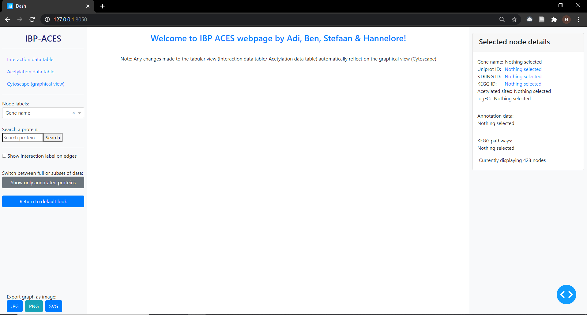

# Integrated bioinformatics project 2020 - 2021

"PACES: Visualization of the acetylome changes in *Pseudomonas aeruginosa* upon phage infection"

By: Aditya Badola, Ben De Maesschalck, Hannelore Longin and Stefaan Verwimp

Supervisors: prof. van Noort, Hanne Hendrickx

Master of Bioinformatics - KU Leuven, Belgium

## Tool: PACES (Pseudomonas ACEtylation Sites)

A bioinformatics tool to visualize acetylome changes in *Pseudomonas aeruginosa* upon phage infection.

### Requirements:

All requirements can be found in paces_env.yml
Using Anaconda, the required environment to run the application smoothly can be build by the command:
  `conda env create -f paces_env.yml`
This environment can then be activated by the command:
  `conda activate pacesEnv`

### Running the application:

**Visualisizing the dataset from** ***Bacteriophage-triggered acetylation is a driver for bacterial metabolic reprogramming in Pseudomonas aeruginosa (De Smet et al.)***

For this dataset, all necessary files for visualization have been generated and are included in the correct folders.
As such users can simply run the *main.py* script located in the Visualisation directory, command given:

Command (assuming pwd = PACES): 
`python Visualisation/main.py`

After successfully running this command, users will get a message stating "Dash is running on {address}".
Users should then open a browser and paste this address into their search bar, after which the application should be visible:

From this page, users can either:
- directly go to the visual representation by clicking "Cytoscape (graphical view)"
- filter the data in either one of the tables by clicking "... data table"

*Note:* Depending on the size of the screen, it can be that the window seems to small to contain all information. If this is the case, just zoom out in your browser until the application fits.

*Filtering the data*

To filter the data, navigate to any of the tabular views.
To apply a filter, type the desired filter into the "filter data..." box of the corresponding column and press enter.
For numerical values, one can filter using > >= = <= <. Do not try to filter with 2, this will generate an error. Instead, use =2.

To undo your filtering, you can press "Show all proteins".
Please note that this will only work when no filter is present in any of the "filter data..." boxes.

Please note that both tables are linked. When one filters on the keyword biofilm in the keggPathways tab of the acetylation data table, all proteins containing this term as one of their KEGG pathways will be shown, as well as all proteins that are interacting with them.

*Interpreting the visualization*

Once the data is filtered as desired, opening the "Cytoscape (graphical view)" will now show you a visual representation of the data.

In this view, every circle represents a protein that was found in the data.
The color of the nodes indicate the log fold change: red is negative, green is positive and gray is indecisive: either because multiple peptides disagree or because the protein was not present in both conditions.
When a line connects two circles, it means that these proteins interact (according to the STRING database, with a minimal score of 0.7).

Users can zoom in and out of the view, put it to left or right as they usually would.
Individual proteins can also be relocated by dragging them.

To get information regarding a specific protein, users can just click it.
This clicking has a few effects:
- the "Selected node details" box on the right displays more information regarding the last clicked protein
- the selected protein has a purple edge and only it's interaction partners remain colored. All other proteins will fade.
- users can press the "Show interaction label on edge", which will display interaction annotation on the lines that indicates interaction, for the last selected protein.
- users can change the gene name to a STRING, KEGG or UniProt ID by selecting this option in the "Node labels" drop down menu.

To return to the initial look, users can press "Return to default look."

If users wish to only view annotated proteins, they can press "Show only annotated proteins", which will automatically remove all proteins lacking annotation from the view.

Users can also search for a specific protein by using the search box.
Users can search on gene name, STRING, UniProt and KEGG ID by typing it and then pressing "Search".
Only exact matches will yield a result.
The searched protein will light up in purple, whereas all other proteins will fade.
To then get any additional information, users should click the purple protein.

Users can also change the way the proteins are represented.
By default they appear on a grid, but different layouts can be explored by making use of the "Choose graph layout style" drop down menu.
This layout does not change anything about the data being represented, it only changes the way they are organised.

If users have created a desired view, they can save it as a picture in either PNG, JPEG or SVG format by pressing these buttons.
This will only save the network of proteins in the middle panel, not the side bars containing the annotation details.

On a final note, the blue circle with <> at the right bottom can be ignored by regular users.
This button will create a pop-up if a bug in the program is encountered, which should not happen under normal usage but could be useful for any future developer working on the application.

**Visualising new data**

Scripts are provided to generate the same visualisation for new data.

Before getting started, users should remove or temporarily store somewhere else these files:
- input.txt (located in Preprocessing)
- all files in the folder Output
- all files in the folder String_man

Once this is done, users should provide a new input file, similar to the original one from *Bacteriophage-triggered acetylation is a driver for bacterial metabolic reprogramming in Pseudomonas aeruginosa (De Smet et al.)*.
This means: a text file called "input.txt" with tab seperated values and containing columns:

 "Protein",	"Protein.Descriptions",	"Positions",	"Position",	"Localization.Prob.", "	Score.Diff.", 	"PEP",	"Score", "Diagnostic.peak",	"Number.of.Acetyl..K.",	"Amino.Acid",	"Modified.Sequence",	"Acetyl..K..Probabilities",	"Acetyl..K..Score.Diffs",	"Position.in.peptide",	"Intensity.", 	"Intensity.L.",	"Intensity.H.",	"Ratio.H.L.Normalized",	"Ratio.H.L.Normalized.Significance"

 Additionally, the assumption is made that the condition in which the phage protein is present, all peptides are labeled with the heavy isotope. If they would be labeled with the light isotope, the detected condition will be opposite to it's true value and the log fold change should be interpreted as it's opposite as well.

If the Output and String_man directory are empty and the new "input.txt" is present in the Preprocessing folder, users should move to the Preprocessing folder and then execute the "main.sh" script.

Command (assuming pwd = PACES/Preprocessing):
`main.sh`

This script will do a couple of things:
- filter the input data
- annotate the proteins with information from KEGG
- fetch the proteins fasta sequences
- reshape the acetylation information to be formulated on a protein level rather than the peptide level

Once the script is finished (this takes a couple of minutes), users should find the following files in Preprocessing/Output:
- filteredData.tsv
- acetylation.tsv
- pathways.tsv
- filteredDataSeq.fasta

At this point, manual intervention is required to complete the preprocessing pipeline.

As a first manual step, users should check if FASTA sequences for all proteins in the data were found.
This can be achieved by executing the "string_check.py" script, when located in the Preprocessing/Scripts folder:

Command (assuming pwd = PACES/Preprocessing/Scripts):
`python string_check.py`

This command will then return a list of all identifiers that are present in the data but NOT in the fasta file.
If the user would like to add these sequences before proceeding, he/she should go to UniProt and find these sequences and then add them to "filteredDataSeq.fasta".

Next, users will have to go to the [STRING database](https://string-db.org/) to retrieve the information regarding the interactions.
There, select "Multiple Sequences" and as an input file, upload the "filteredDataSeq.fasta" and specify "Pseudomonas aeruginosa" as organism.
After pressing search, download the mapping file and then continue to the STRING database.
Once loaded, go to the export tab and download "simple tabular text output"  and "protein annotations".
All downloaded files ("string_interactions.tsv","string_mapping.tsv","string_protein_annotations.tsv") should be stored under "Preprocessing/String_man".

Once all this information is downloaded and located at the correct place, users can go on to the final step: aggregating all data into the correct format for the visualisation platform.
To do so, users should locate to the Preprocessing/Scripts folder and execute "aggregate.py".

Command (assuming pwd = PACES/Preprocessing/Scripts):
`python aggregate.py`

This should generate 2 new files in the output directory:
- nodeDf.tsv
- ackegg.tsv

Once these files are successfully generated, the visualisation can happen, in the exact same fashion as before.
